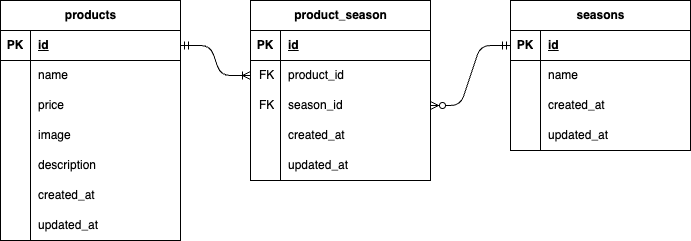

# もぎたて

## 環境構築

Dockerビルド

1.  git clone https://github.com/YumiOotake/mogitate-test.git
2.  docker-compose up -d --build

Laravel環境構築

1.  docker-compose exec php bash
2.  composer install
3.  .env.exampleファイルから.envを作成
    cp .env.example .env

    以下を編集：
    ```
    DB_CONNECTION=mysql
    DB_HOST=mysql
    DB_PORT=3306
    DB_DATABASE=laravel_db
    DB_USERNAME=laravel_user
    DB_PASSWORD=laravel_pass
    ```
4.  php artisan key:generate
5.  php artisan migrate
6.  php artisan db:seed
7.  php artisan storage:link

## 使用技術(実行環境)

- PHP 8.1
- Laravel 8.83.8
- Nginx 1.21.1
- MySQL 8.0
- phpMyAdmin
- Docker / Docker Compose

## ER図



## URL

・開発環境：http://localhost/products
・phpMyAdmin：http://localhost:8080/
